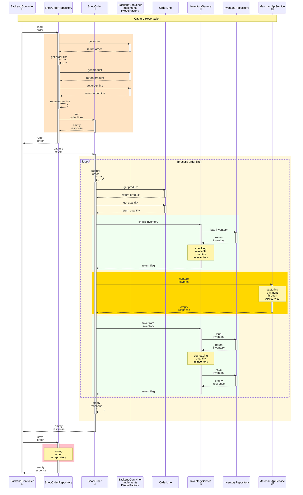

```mermaid
sequenceDiagram
participant BC as BackendController<br/>🔵
participant SOR as ShopOrderRepository
participant SO as ShopOrder<br/>🔴
participant IMF as BackendContainer<br/>implements<br/>IModelFactory
participant OL as OrderLine
participant IS as InventoryService<br/>🟡
participant IR as InventoryRepository
participant MAS as MerchantApiService<br/>🟡

Note over BC,MAS: Capture Reservation
BC ->> SOR: load<br/>order
activate BC
activate SOR
rect bisque
   SOR ->> IMF: get order
   activate IMF
   IMF -->> SOR: return order
   deactivate IMF
   SOR ->> SOR: get order line
   activate SOR
   SOR ->> IMF: get product
   activate IMF
   IMF -->> SOR: return product
   deactivate IMF
   SOR ->> IMF: get order line
   activate IMF
   IMF -->> SOR: return order line
   deactivate IMF
   SOR -->> SOR: return order line
   deactivate SOR
   SOR ->> SO: set<br/>order lines
   activate SO
   SO -->> SOR: empty<br/>response
end
deactivate SO
SOR -->> BC: return<br/>order
deactivate SOR

BC ->> SO: capture<br/>order
activate SO
rect cornsilk
loop process order line
   SO ->> SO: capture<br/>order
   activate SO
   SO ->> OL: get product
   activate OL
   OL -->> SO: return product
   deactivate OL
   SO ->> OL: get quantity
   activate OL
   OL -->> SO: return quantity
   deactivate OL
   rect honeydew
      SO ->> IS: check inventory
      activate IS
      IS ->> IR: load inventory
      activate IR
      IR -->> IS: return<br/>inventory
      deactivate IR
      Note over IS: checking<br/>available<br/>quantity<br/>in inventory
      IS -->> SO: return flag
      deactivate IS
   end
   rect gold
   SO ->> MAS: capture<br/>payment
   activate MAS
      Note over MAS: capturing<br/>payment<br/>through<br/>API service
      MAS -->> SO:  empty<br/>response
   deactivate MAS
   end
   rect honeydew
      SO ->> IS: take from<br/>inventory
      activate IS
      IS ->> IR: load<br/>inventory
      activate IR
      IR -->> IS: return<br/>inventory
      deactivate IR
      Note over IS: decreasing<br/>quantity<br/>in inventory
      IS ->> IR: save<br/>inventory
      activate IR
      IR -->> IS: empty<br/>response
      deactivate IR
      IS -->> SO: return flag
      deactivate IS
   end
end
SO -->> SO: empty<br/>response
deactivate SO
end
SO -->> BC: empty<br/>response
deactivate SO

BC ->> SOR: save<br/>order
activate SOR
rect pink
   Note over SOR: saving<br/>order<br/>in repository
end
SOR -->> BC: empty<br/>response
deactivate SOR
deactivate BC
```
