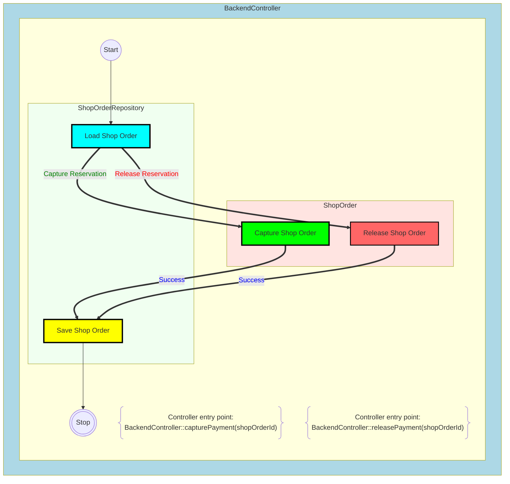

```mermaid
flowchart
subgraph BackendController
  subgraph " "
    START@{ shape: circle, label: "Start" }
    subgraph ShopOrder
      CAPT[Capture Shop Order]:::GreenBox
      RELE[Release Shop Order]:::RedBox
    end
    subgraph ShopOrderRepository
      LOAD[Load Shop Order]:::CyanBox
      SAVE[Save Shop Order]:::YellowBox
    end
    STOP@{ shape: dbl-circ, label: "Stop" }
    COM1@{ shape: braces, label: "Controller entry point:<br/>BackendController::capturePayment(shopOrderId)" }
    COM2@{ shape: braces, label: "Controller entry point:<br/>BackendController::releasePayment(shopOrderId)" }
  end
end
class BackendController LightBlueBox
class ShopOrderRepository HoneyDewBox
class ShopOrder MistyRoseBox
%% Flows
  START --> LOAD
  LOAD == Capture Reservation ==> CAPT
  LOAD == Release Reservation ==> RELE
  CAPT == Success ==> SAVE
  RELE == Success ==> SAVE
  SAVE --> STOP
%% Style Definitions
  linkStyle 1 color: Green;
  linkStyle 2 color: Red;
  linkStyle 3,4 color: Blue;
  classDef RedBox fill: #ff6666, stroke: #000, stroke-width: 2px
  classDef GreenBox fill: #00ff00, stroke: #000, stroke-width: 3px
  classDef CyanBox fill: Cyan, stroke: #000, stroke-width: 3px
  classDef YellowBox fill: Yellow, stroke: #000, stroke-width: 3px
  classDef OrangeBox fill: #ffa500, stroke: #000, stroke-width: 3px
  classDef LightBlueBox fill: LightBlue
  classDef HoneyDewBox fill: HoneyDew
  classDef MistyRoseBox fill: MistyRose
```
