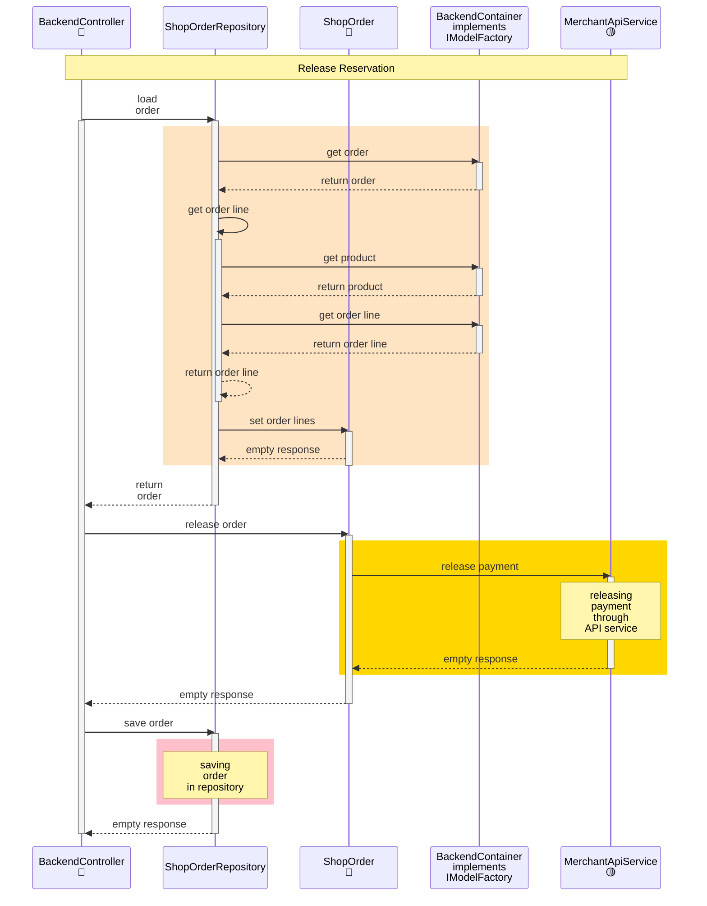

```mermaid
sequenceDiagram
 participant BC as BackendController<br/>🔵
 participant SOR as ShopOrderRepository
 participant SO as ShopOrder<br/>🔴
 participant IMF as BackendContainer<br/>implements<br/>IModelFactory
 participant MAS as MerchantApiService<br/>🟡

Note over BC,MAS: Release Reservation
BC ->> SOR: load<br/>order
activate BC
activate SOR
rect bisque
   SOR ->> IMF: get order
   activate IMF
   IMF -->> SOR: return order
   deactivate IMF
   SOR ->> SOR: get order line
   activate SOR
   SOR ->> IMF: get product
   activate IMF
   IMF -->> SOR: return product
   deactivate IMF
   SOR ->> IMF: get order line
   activate IMF
   IMF -->> SOR: return order line
   deactivate IMF
   SOR -->> SOR: return order line
   deactivate SOR
   SOR ->> SO: set order lines
   activate SO
   SO -->> SOR: empty response
end
deactivate SO
SOR -->> BC: return<br/>order
deactivate SOR

BC ->> SO: release order
activate SO
rect gold
   SO ->> MAS: release payment
   activate MAS
      Note over MAS: releasing<br/>payment<br/>through<br/>API service
      MAS -->> SO:  empty response
   deactivate MAS
end
SO -->> BC: empty response
deactivate SO

BC ->> SOR: save order
activate SOR
rect pink
   Note over SOR: saving<br/>order<br/>in repository
end
SOR -->> BC: empty response
deactivate SOR
deactivate BC
```
